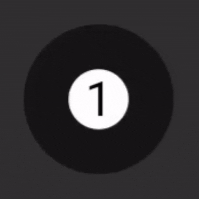
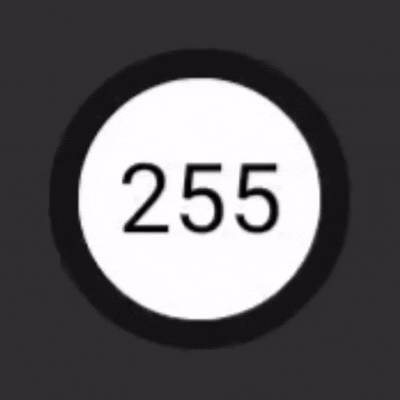
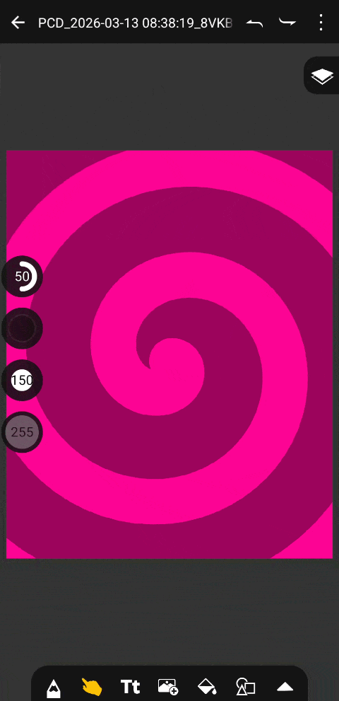
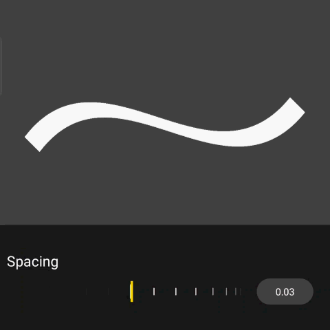
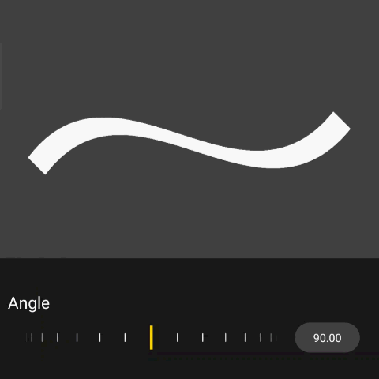
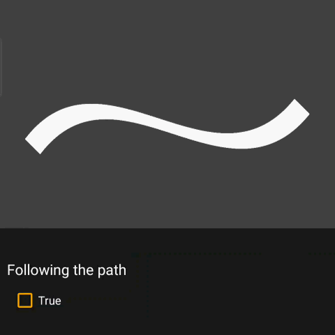
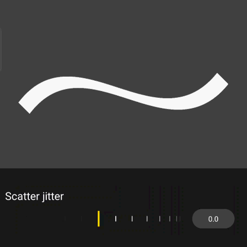
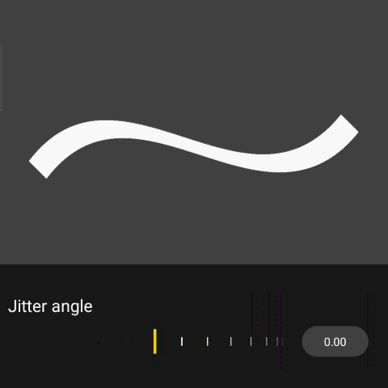
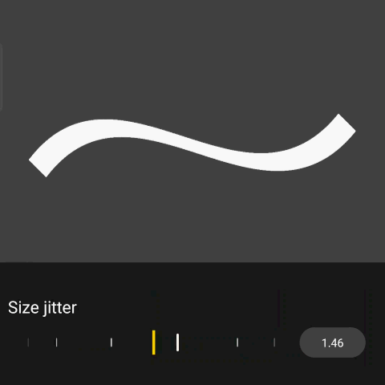

# Pocket Canvas Draw (PCD)
Pocket Canvas Draw (PCD) is an advanced, feature-rich drawing and painting application designed for Android. Whether you are sketching on the go or creating detailed digital art, PCD provides a powerful and intuitive canvas to bring your ideas to life.

Originally created in Sketchware and celebrated as an "Editor's Choice" on the Sketchub platform in 2020, this repository houses the completely rebuilt and upgraded version developed natively in Android Studio.

# Core Features
## Professional Drawing Tools
 * Dynamic Brush Adjustments: Easily adjust your brush size (1–500) and opacity (0–255) using intuitive sliders. The UI provides a real-time miniature preview of your brush footprint.

  
  &nbsp;&nbsp;
  

   
 * Quick Toggles: Seamlessly switch between brush and eraser modes with a single tap.
 * Advanced Color Picker: Choose your exact shade for brushes, text, or shapes using a comprehensive pop-up color picker.
 * Smart Canvas Navigation: Zoom, pan, and rotate the canvas naturally with multi-touch finger gestures for a professional workflow.

## Layer Management
Layers are the backbone of any serious digital art app. In PCD, you can easily add, lock, toggle visibility, and rearrange layers to suit your workflow.
 * Blend Modes: Take your art further with professional blending functions, including: NORMAL (SRC_OVER), MULTIPLY, SCREEN, OVERLAY, DARKEN, LIGHTEN, XoR, and CLEAR.

## Smudge & Blending
Blend colors directly on the canvas using the Smudge tool. You have full control over both the size of the smudge brush and its intensity (0–100).

## Text, Media, and Shapes
* Custom Text: Add text to your canvas with support for imported custom fonts (.ttf or .otf).

* Image Import: Bring reference images directly onto your canvas (requires media read permissions).
 

* Geometric Shapes: Draw shapes dynamically by dragging diagonally. Choose between FILL or STROKE modes for distinct styles.
 

 Tip: Commit your media or shape adjustments by tapping the top checkmark icon, or simply double-tap the screen quickly!
Productivity Boosters

* Fill Mode: Quickly flood an area with color. Adjust the tolerance (1–100) by dragging from the top or bottom of the screen.

* Color Eyedropper: Long-press anywhere on the canvas to instantly grab a color.

## Custom Brush Engine
PCD features a highly customizable brush engine, allowing you to import or create your own unique brushes. Open the brush panel, tap the + icon, and start experimenting!
 * Pattern Import: Select any 1:1 ratio image to act as your brush tip.
 * Masking: Toggle the negative filter to use black/white as a mask to remove the background of your pattern.
 * Spacing: Control the distance between brush stamps. (Note: Setting this below 0.03 may cause performance drops).

 * Angle & Following Path: Set a fixed angle for a "marker" effect, or toggle "Following path" so the brush stamp rotates dynamically with your stroke.

&nbsp;&nbsp;

 * Jitter Effects: Introduce randomness to your strokes! Adjust Scatter (for spray effects), Jitter Angle, and Jitter Size for organic, varied textures.

&nbsp;&nbsp;

&nbsp;&nbsp;

<em>Visualizing Scatter, Angle, and Size Jitter effects.</em>

 
## Project Saving & Exporting
Never lose your work. You can safely exit the app and PCD will serialize your progress.
 * Export: Save your projects as .pcdproj files to back them up or share them.
 * Powered by GSON: Project serialization and deserialization are handled quickly and efficiently by the Google GSON library.
 
# Known Issues & Troubleshooting
We are constantly working to improve PCD. Here are a few known quirks and how to handle them:
> The "Blank Project" & Layer Deletion Bug
> Issue: If you delete a reference layer, the adjacent layer below it might unjustifiably empty its contents. Very rarely, opening a project might also result in a blank canvas.
> Workaround: Do NOT exit normally (which triggers an auto-save). Instead, long-press the left arrow in the top-left toolbar. A dialog box will appear allowing you to exit without saving, preserving your original work.
> 
> Transparent Background Smudging
> Issue: Using the Smudge tool directly on a transparent background may unexpectedly pull in black colors.
> Workaround: We highly recommend filling your background layer with a solid color (like white) before using the smudge tool.
> 
> Ghost Paths
> Issue: Accidentally touching the screen with an extra finger while drawing may leave an uncommitted "ghost" stroke.
> Workaround: Simply draw a new stroke anywhere on the canvas, and the ghost path will vanish.
> 

Found a new bug? Please open an Issue to report it!

# Contributing
This project is continuously evolving, and contributions are incredibly welcome! Whether you are fixing bugs, adding new brush parameters, or optimizing the canvas rendering, feel free to fork this repository and submit a pull request.

# Acknowledgments:
 * Google GSON: For handling the .pcdproj file serialization.
